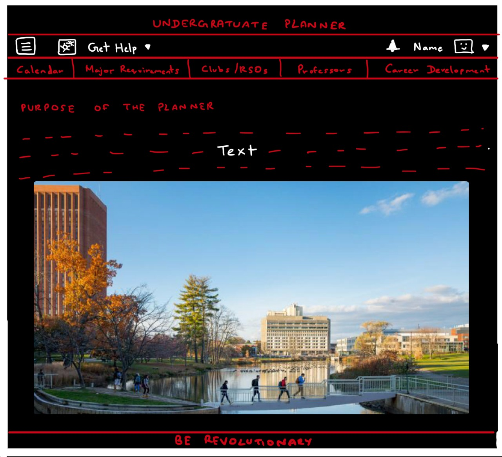
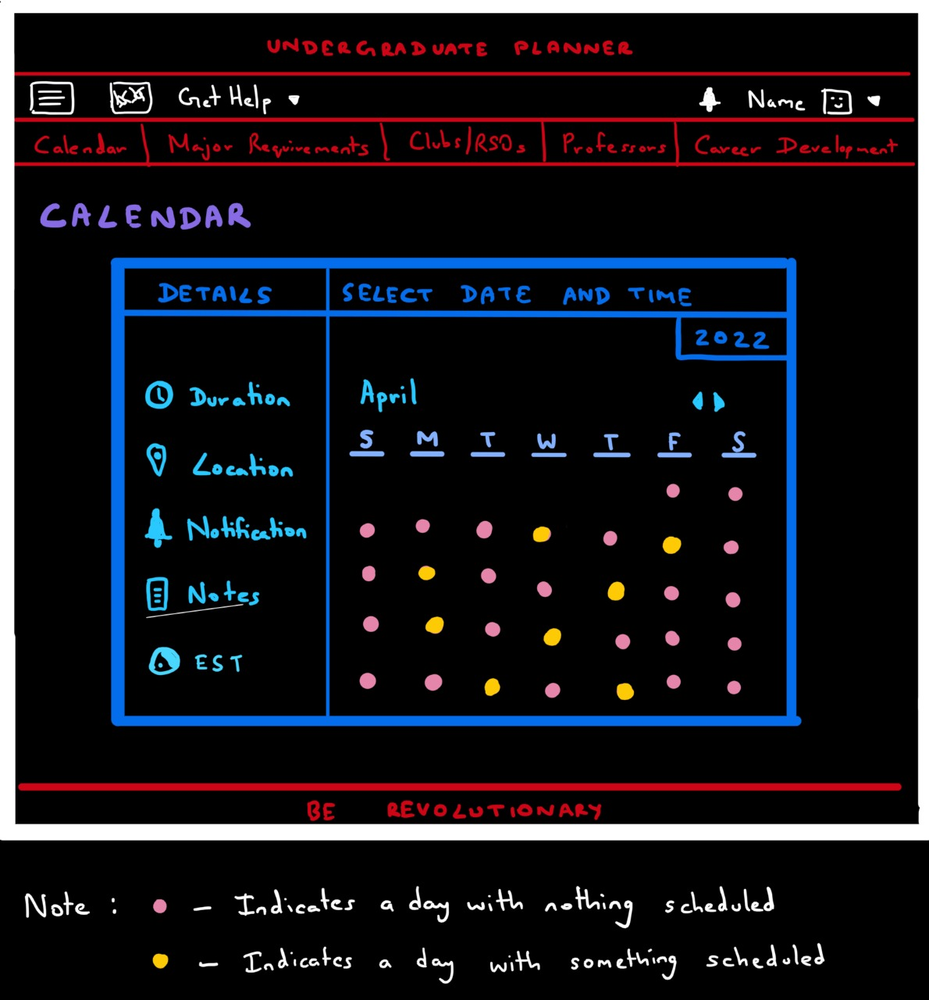
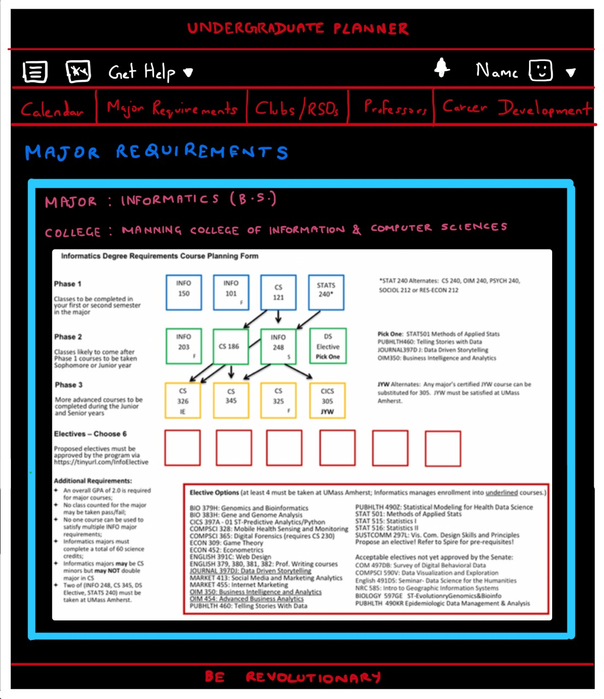
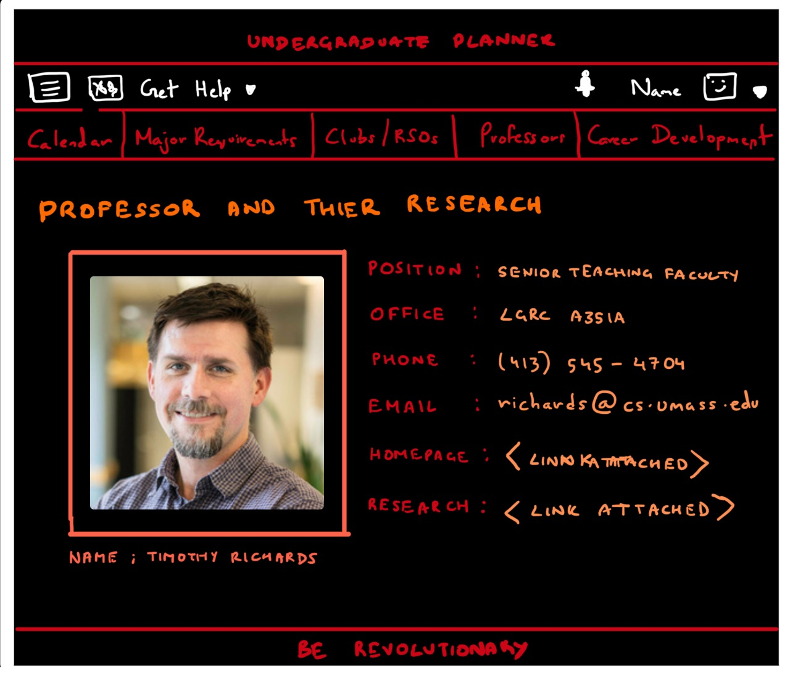
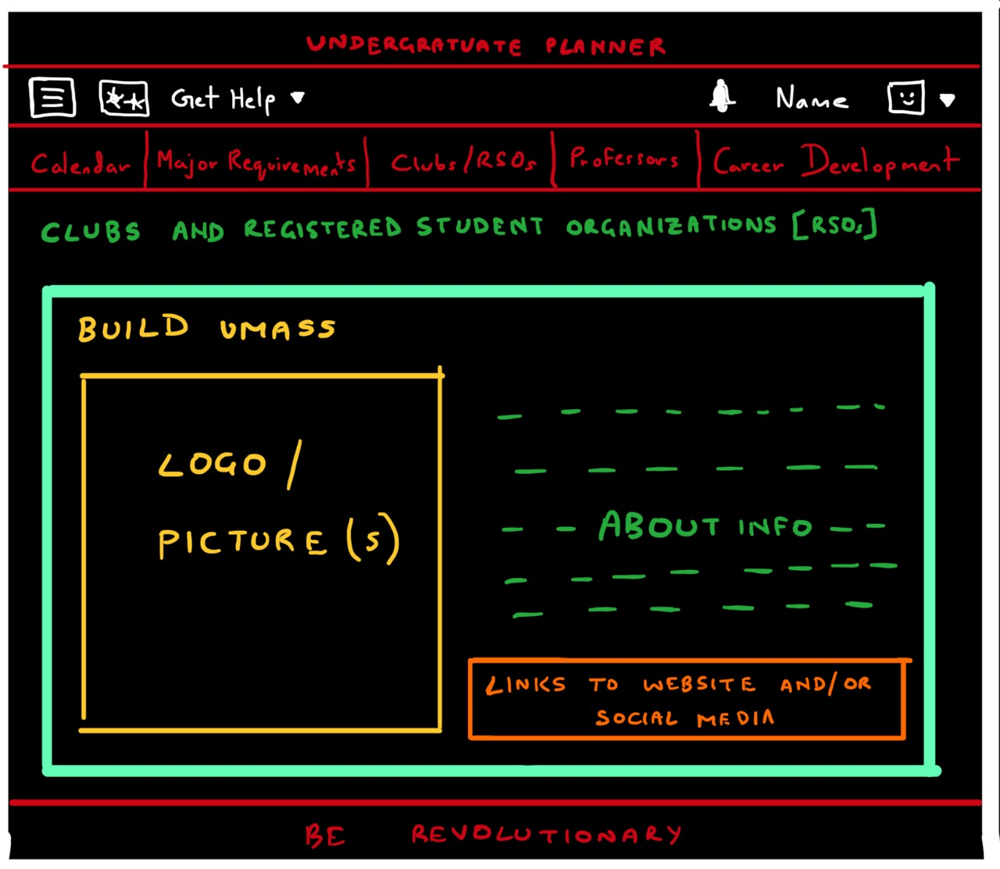
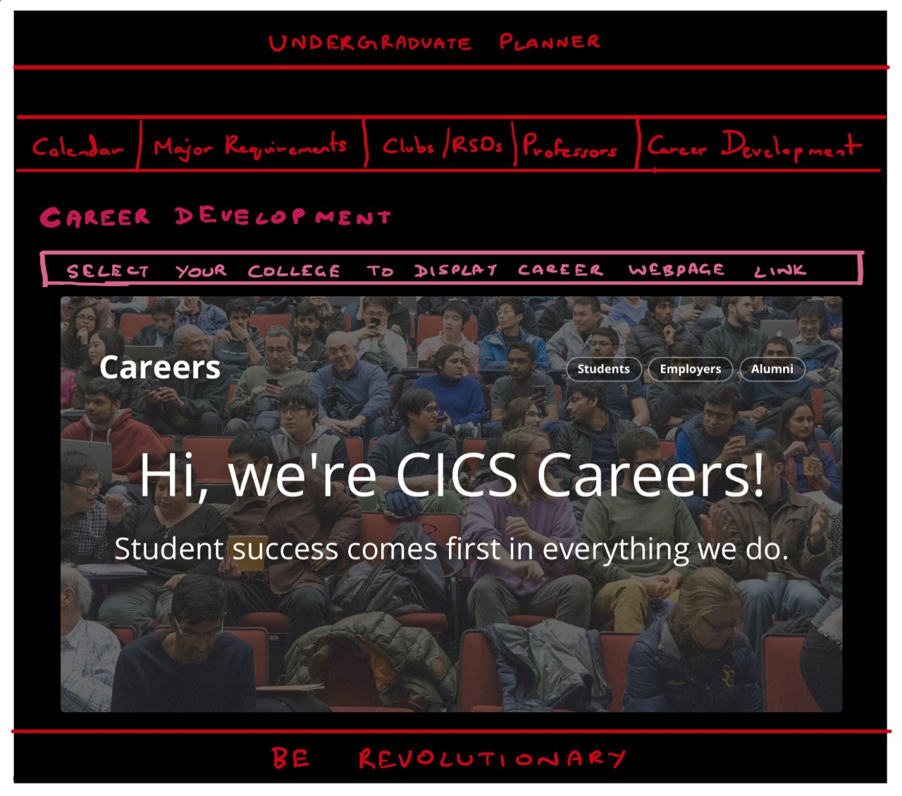
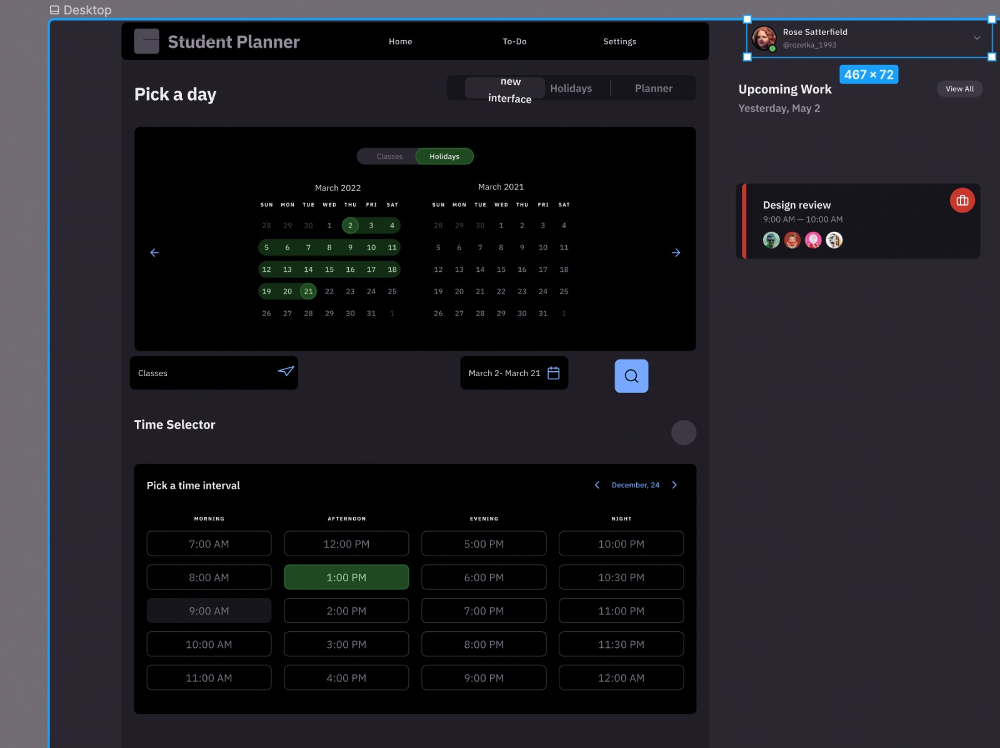

# TEAM NAME

- PHPHaters

# WEB APPLICATION NAME

- Undergrad Planner

# TEAM OVERVIEW

- Shubh Vashisht
- Tanishk Jain
- Shreya Khettry
- Varisht Aggarwal

# INNOVATIVE IDEA

As undergraduate students, we have realized that the main aspect, in having a successful academic career at university, is planning. Prior planning has always been advantageous even in the cases where everything does not go according to plan, as an individual always has a backup. Backups are only possible with prior planning. This is the main motive behind our idea of creating an all-in-one multi-aspect planner for undergraduate students. Our planner will help students to do the following:

- Plan out courses for future semesters
- Keep backups just in case a desired course is unavailable
- Provide a platform to plan out their day/week - add meetings, deadlines, reminders etc.
- Filter and highlight clubs and/or activities that pertain to their interest
- Provide resources that can help them get hands-on experience in research and/or industry

# PART 0: DATA INTERACTIONS

- Courses per major (for a subset of majors initially) that can be in a semester-wise block-like format, can have a check box and a list of potential options for upcoming semesters
- A calendar with their course schedule and options for adding in personal agendas
- Clubs and extracurricular activities that will be provided based on the interests of the user
- Provide a list of all professors and what research (plus labs) they are doing. So a user can provide their academic interests and our web app can highlight research potentials that the user might find interesting.
- Internships from the Career Development Center to provide a list of internship opportunities for students (who can add their areas of interest)

# PART 1: WIREFRAMES AND USER INTERFACES

- Image 1: The image above is a screenshot of a sketch of the landing page of our application. We will have a navigation bar and hero-section in addition to a footer. The navigation bar will have all the links to different pages and will therefore be used to navigate in between different pages.

- Image 2: The image above is a screenshot of a sketch of our application's calendar user interface. This page will allow the user to check their schedule and plan out courses accordingly.

- Image 3: The above image is a screenshot of a sketch of the major requirements page of our application. This page will provide us with the information needed for major requirements as well as the various courses and their descriptions.

- Image 4: The above image is a screenshot of a sketch of the research page of our application. This page will provide us with the information of different types of research areas and the research categories under them that are going on in the campus and the faculty working there. The information will involve the professors' image, office and contact information.

- Image 5: The above image is a screenshot of a sketch of the clubs and RSOs page of our application. This page will provide us with the information of different clubs/RSOs present in the university and how we can join them.

- Image 6: The above image is a screenshot of a sketch of the career development page of our application. This page will provide us with different web pages related to different colleges at UMASS and the various links to the career sites of the different colleges.

- Image 7: The above is a Figma Design for the calendars page.

# Breakdown of Work

- Shreya: Part 1: Wireframes and Sketches
- Tanishk: Part 2: HTML and CSS
- Shubh: Part 2: HTML and CSS