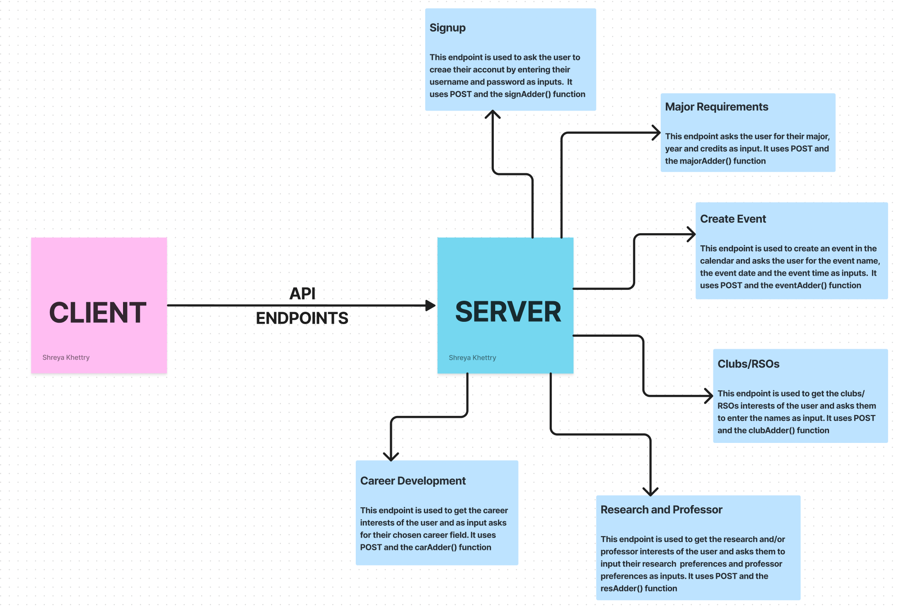

# TEAM NAME

- PHPHaters

# WEB APPLICATION NAME

- Undergraduate Planner

# TEAM OVERVIEW

- Tanishk Jain
- Shreya Khettry
- Shubh Vashisht
- Varisht Aggarwal

# PART 0: Project API Planning

The following Flowchart displays all the various information that the client obtains from the back-end server. The endpoint name and a brief description of each endpoint is provided as well along with their different functionalities.

# PART 1: Back-end Skeleton Code

Nothing was supposed to be added.

# PART 2: Front-end Implementation

# PART 3: Deployment

URL of the Heroku Application: https://phphatersserver.herokuapp.com/

# Breakdown of Work

- Tanishk: Front-End Implementation of the Code (Part 2)
- Shreya: Back-End Implementation of the Code (Part 1), Flowchart (Part 0), creation and implementation of the 'milestone2.md' document
- Shubh: Heroku Deployment (Part 3)