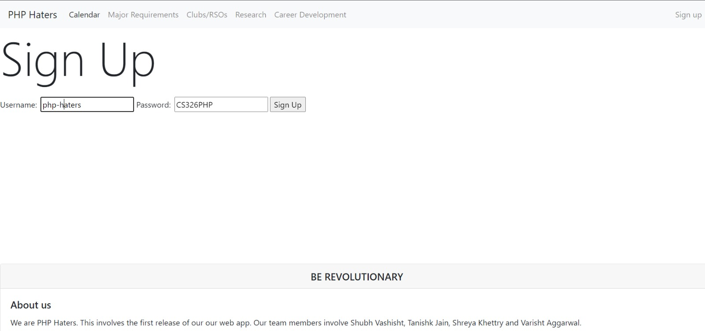
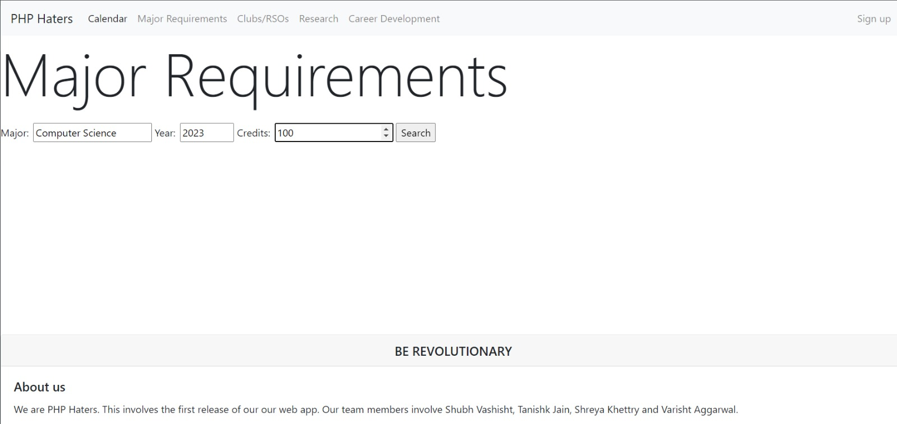
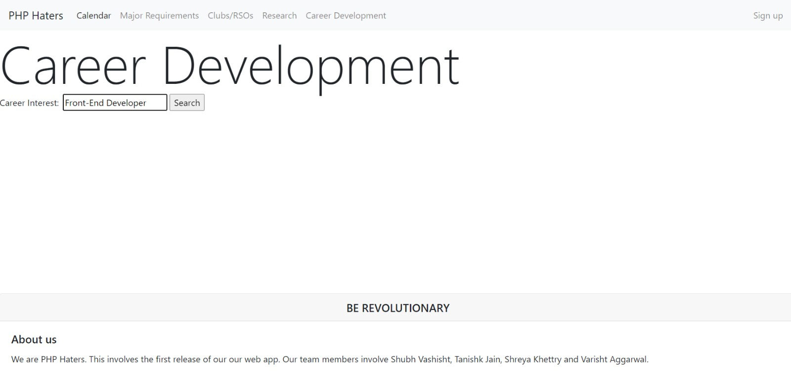

# TEAM NAME

- PHPHaters

# WEB APPLICATION NAME

- Undergraduate Planner

# TEAM OVERVIEW

- Tanishk Jain
- Shreya Khettry
- Shubh Vashisht
- Varisht Aggarwal

# PART 0: Project API Planning

The following Flowchart displays all the various information that the client obtains from the back-end server. The endpoint name and a brief description of each endpoint is provided as well along with their different functionalities.

# PART 1: Back-End Skeleton Code Implementation

Nothing was supposed to be added.

# PART 2: Front-End Implementation

- The following screenshot displays our Signup page. The user enters their username and password which is simultaneously added to server. It is using POST right now and we plan to implement a PUT to make password updates.

- The next screenshot displays the Major Requirements Page. The user inputs their major, year and credits into the page and this gets stored in the server. This is in POST right now to establish client server connection however it will be converted to GET once we parse requirements from the UMass website. So the user will enter their information, and the resulting requirements will be displayed.

- The following screenshot shows our Calendar page. The user can add event name, date, and time and these get stored in the server. We will render it into a calendar interface.

- NOTE: We will have a DELETE event in case user wants to delete an event. The Skeleton code is added to our back-end server implementation, however it is not fully implemented at the front-end.

- The next screenshot shows our Career Development page. The user inputs their career interest and this gets stored in the server. It is in POST right now to establish the server-client connection however we will change it to GET once we are able to scrape information from the internet about different internships/jobs etc.

# PART 3: Heroku Deployment

URL of the Heroku Application: https://phphatersserver.herokuapp.com/

# Breakdown of Work

- Tanishk: Front-End Implementation of the Code (Part 2)
- Shreya: Back-End Implementation of the Code (Part 1), Flowchart (Part 0), the 'milestone2.md' and 'setup.md' documents
- Shubh: Heroku Deployment (Part 3)